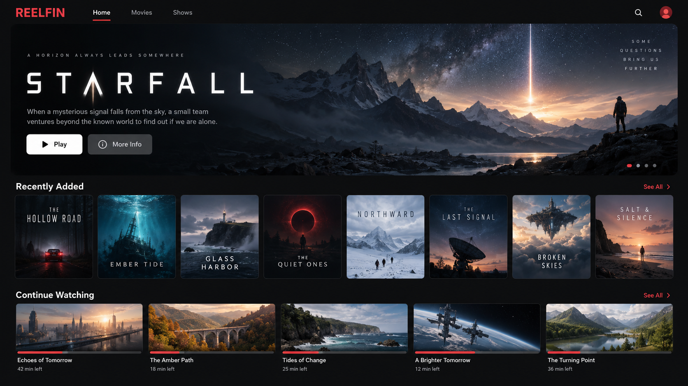
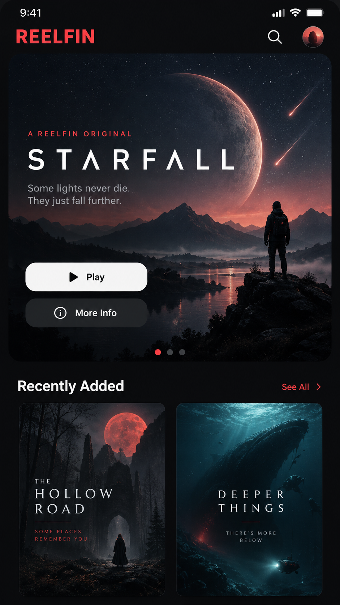

# Reelfin

A Netflix-inspired CSS theme for Jellyfin Web. Dark browsing UI, a Continue Watching hero, responsive cards and native Jellyfin controls.

## Preview

Concept mockups with fictional media. These are **not** screenshots of a live Jellyfin server.





## Install

Paste this into **Dashboard → Branding → Custom CSS**, then save and reload:

```css
@import url("https://cdn.jsdelivr.net/gh/jaydip216/reelfin@master/netflix-inspired.css");
```

For the hero, put **Continue Watching** first in your Home settings. The rest of the theme works with any home order. Artwork and card shapes follow Jellyfin's native image selection, including newly added media.

Works in Jellyfin Web; native clients may not apply custom CSS. [MIT licensed](LICENSE).
